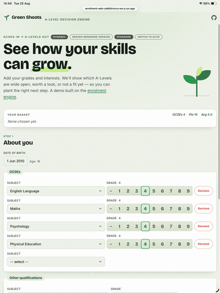

# Enrolment Rules Engine - AI assisted enrolment decisions

This is a recreation of a proprietary project I developed a few years ago, to assist in enrolment decision-making and ensure policies were consistently followed. The real system was also capable of writing the complete enrolment package into the management information system, and printing forms for signature.

### [Green Shoots demo site](https://enrolment-web-zeb6shxnca-ew.a.run.app)

**May take a couple of seconds to wake the docker image**

*Green Shoots* is the engine's front end demo: staff enter a student's GCSE results and any prior
qualifications, and instantly get a recommendation for every A-Level subject on offer, each with a
plain-English reason. It gives admissions and pastoral staff a consistent, defensible answer for
every student in seconds rather than a judgement call that varies by who's on duty, and a clear
audit trail for why a decision was made if it's ever challenged.

## A monotonic, rules-as-data engine for A-Level enrolment decisions

The full source code can be found in the [Project folder](EnrolmentRules/)

### AI in Production

This engine is an application of AI using multiple techniques: **statistical learning** paired with a **symbolic AI**
engine. Linear regression over GCSE results predicts each student's likely A-Level outcome
from historical attainment data - the statistical learning half.
That prediction then feeds a symbolic AI engine, which evaluates the institution's published
policy - entry thresholds, subject ratings, prerequisites, exclusions - as explicit,
human-readable rules. Every recommendation is completely reproducible and highly interpretable. Run the same student through
the same policy and you get the same answer, every time, with a plain-English reason attached -
none of the black-box guesswork that comes with a purely statistical model.

Managers have full control over rule application. They can be written as simple logical expressions.

### Walkthrough

This 30 second video shows the engine in action for music enrolment at an imaginary college with some quirky rules.

1. We start with 4x GCSE at grade 4, insufficient for an A-Level programme at this college.
2. We add Music at grade 4, crossing the eligibility threshold for a basic programme (5x grade 4), but not sufficient to study music. 3 other A-levels become green but Music is red.
3. We change the Music GCSE grade to 5, and Music A-level now becomes amber. This means borderline, the department wants music students to play an instrument in their own time.
4. We add ‘Plays piano’ as a hobby, and Music now becomes green! The course criteria are met, and the student can proceed.
5. With tongue in cheek, our head of music really hates the trombone. If we add a second hobby ‘Plays trombone’ the subject becomes red. No trombone players are allowed in his class.

This demonstrates some of the complex rules that can be quickly configured using this decision engine, including on student attributes like age, entry subject combinations, selections for A-Level and hobbies. All rules are fully customisable. For more details see [rule-authoring.md](EnrolmentRules/docs/rule-authoring.md)

## License

AGPLv3. See [LICENSE](LICENSE) and [THIRD-PARTY-NOTICES.md](THIRD-PARTY-NOTICES.md).
